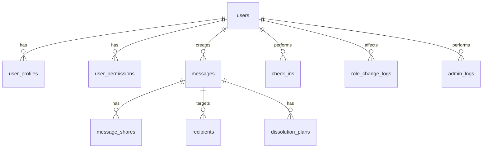
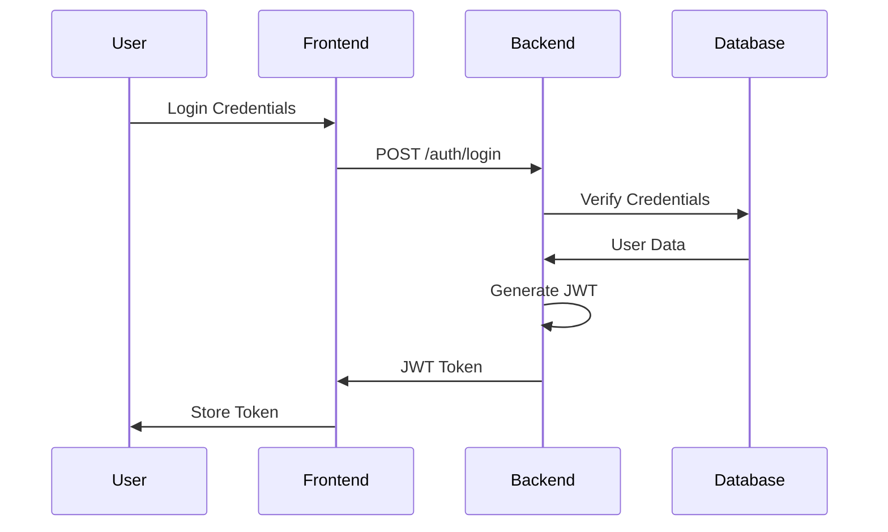
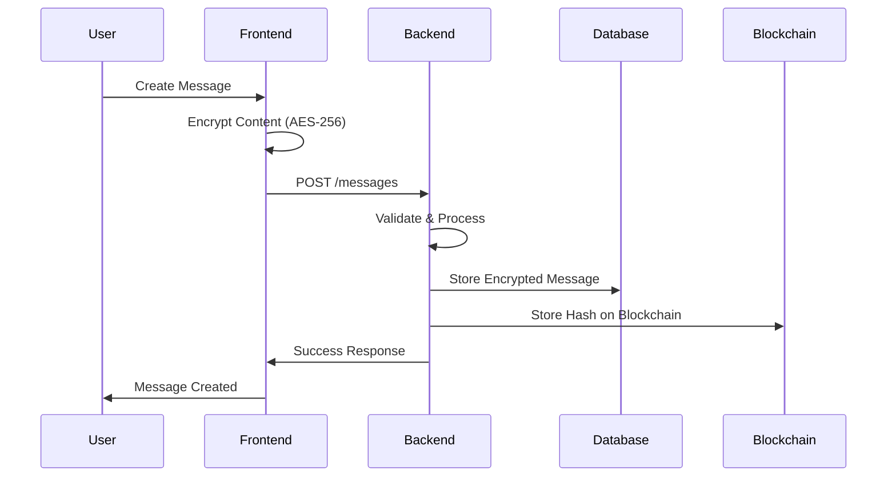
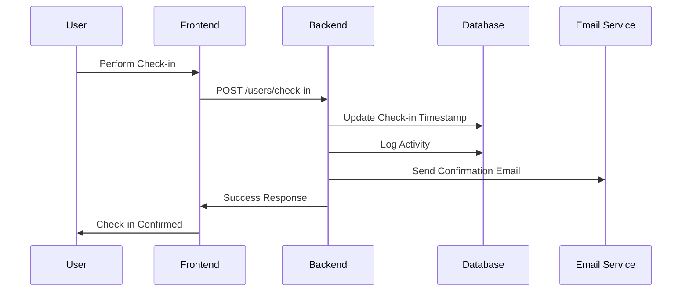

# Secret Safe - Architecture Documentation

## 🏗️ System Overview

Secret Safe is a privacy-first digital dead man's switch service built with a modern, scalable architecture that prioritizes security, reliability, and user experience.

### Core Principles

- **Zero-Knowledge Architecture**: We cannot read user messages
- **Role-Based Access Control**: Granular permissions for different user types
- **Blockchain Backup**: Immutable storage for critical data
- **Company Dissolution Protection**: Messages delivered even if we cease operations
- **Glassmorphic UI/UX**: Beautiful, modern interface design

## 🏛️ High-Level Architecture

```
┌─────────────────┐    ┌─────────────────┐    ┌─────────────────┐
│   Frontend      │    │    Backend      │    │   Blockchain    │
│   (Next.js)     │◄──►│   (FastAPI)     │◄──►│   (ICP/Arweave) │
└─────────────────┘    └─────────────────┘    └─────────────────┘
         │                       │                       │
         │                       │                       │
         ▼                       ▼                       ▼
┌─────────────────┐    ┌─────────────────┐    ┌─────────────────┐
│   Vercel        │    │   Supabase      │    │   IPFS          │
│   (Hosting)     │    │   (Database)    │    │   (Backup)      │
└─────────────────┘    └─────────────────┘    └─────────────────┘
```

## 🎯 Technology Stack

### Frontend
- **Framework**: Next.js 14 (App Router)
- **Language**: TypeScript
- **Styling**: Tailwind CSS + Shadcn/ui
- **State Management**: Zustand
- **3D Graphics**: Three.js
- **HTTP Client**: Axios + React Query
- **Authentication**: NextAuth.js

### Backend
- **Framework**: FastAPI
- **Language**: Python 3.11+
- **Database ORM**: SQLModel (SQLAlchemy)
- **Authentication**: JWT + bcrypt
- **Task Queue**: Celery + Redis
- **Email**: SendGrid/AWS SES
- **Logging**: Structlog

### Infrastructure
- **Hosting**: Vercel (Frontend) + Supabase (Backend)
- **Database**: PostgreSQL (Supabase)
- **Caching**: Redis
- **CDN**: Vercel Edge Network
- **Monitoring**: Sentry
- **CI/CD**: GitHub Actions

### Blockchain & Storage
- **Primary**: Internet Computer Protocol (ICP)
- **Backup**: Arweave (permanent storage)
- **Distributed**: IPFS (interplanetary backup)
- **Smart Contracts**: ICP Canisters

## 🗄️ Database Architecture

### Core Tables

#### Users & Authentication
```sql
-- User management and authentication
users                    -- Core user data
user_profiles           -- Extended profile information
user_permissions        -- Granular permissions
role_change_logs        -- Audit trail for role changes
check_ins              -- User activity tracking
```

#### Messages & Content
```sql
-- Message storage and management
messages                -- Encrypted message content
message_shares          -- Message sharing relationships
recipients              -- Message delivery targets
dissolution_plans       -- Company dissolution contingencies
```

#### System & Audit
```sql
-- System administration and monitoring
admin_logs              -- Administrative actions
audit_trails            -- Security audit logs
system_metrics          -- Performance monitoring
```

### Database Relationships



## 🔐 Security Architecture

### Authentication Flow



### Role-Based Access Control

```python
# Role hierarchy (most to least privileged)
ROLES = {
    "admin": 100,      # Full system access
    "ultimate": 90,     # Blockchain features
    "enterprise": 80,   # Advanced features
    "professional": 70, # Premium features
    "writer": 50,       # Message creation
    "reader": 10,       # Read-only access
    "free": 0           # Basic access
}
```

### Encryption Strategy

- **Client-Side**: AES-256 encryption before transmission
- **In-Transit**: TLS 1.3 for all communications
- **At-Rest**: Database-level encryption (Supabase)
- **Backup**: Blockchain-immutable encrypted storage

## 🚀 API Architecture

### RESTful Endpoints

#### Authentication Routes
```
POST   /auth/register          # User registration
POST   /auth/login            # User login
POST   /auth/logout           # User logout
GET    /auth/me               # Current user info
POST   /auth/refresh          # Refresh JWT token
POST   /auth/forgot-password  # Password reset request
POST   /auth/reset-password   # Password reset
```

#### Message Management
```
POST   /messages              # Create message
GET    /messages              # List user messages
GET    /messages/{id}         # Get specific message
PUT    /messages/{id}         # Update message
DELETE /messages/{id}         # Delete message
POST   /messages/{id}/share   # Share message
POST   /messages/{id}/check-in # Check-in for message
```

#### User Management
```
GET    /users/profile         # Get user profile
PUT    /users/profile         # Update user profile
PUT    /users/password        # Change password
POST   /users/check-in        # Perform check-in
GET    /users/check-in-history # Get check-in history
```

#### Admin Routes
```
GET    /admin/users           # List all users
GET    /admin/users/{id}      # Get user details
PUT    /admin/users/{id}/role # Change user role
PUT    /admin/users/{id}/suspend # Suspend user
GET    /admin/messages        # List all messages
GET    /admin/overview        # System overview
GET    /admin/audit-logs      # Audit logs
```

### Middleware Stack

```python
# Request processing order
1. TrustedHostMiddleware      # Host validation
2. CORSMiddleware             # CORS handling
3. AuthMiddleware             # JWT authentication
4. RoleBasedMiddleware        # Role-based access control
5. RateLimitMiddleware        # Rate limiting
6. Request processing
7. Response processing
8. Exception handling
```

## 🌐 Frontend Architecture

### Component Structure

```
app/
├── components/
│   ├── ui/                   # Shadcn/ui components
│   ├── three/                # Three.js components
│   ├── auth/                 # Authentication components
│   ├── messages/             # Message management
│   ├── admin/                # Admin interface
│   └── layout/               # Layout components
├── lib/
│   ├── utils.ts              # Utility functions
│   ├── auth.ts               # Authentication logic
│   ├── api.ts                # API client
│   └── store.ts              # Zustand stores
├── hooks/                    # Custom React hooks
└── types/                    # TypeScript type definitions
```

### State Management

```typescript
// Zustand store structure
interface AppState {
  // Authentication
  user: User | null
  isAuthenticated: boolean
  token: string | null
  
  // Messages
  messages: Message[]
  currentMessage: Message | null
  
  // UI State
  theme: 'light' | 'dark'
  sidebarOpen: boolean
  
  // Actions
  login: (credentials: LoginCredentials) => Promise<void>
  logout: () => void
  fetchMessages: () => Promise<void>
  // ... more actions
}
```

### Routing & Navigation

```typescript
// App Router structure
app/
├── (auth)/                   # Authentication routes
│   ├── login/
│   ├── register/
│   └── forgot-password/
├── (dashboard)/              # Protected routes
│   ├── messages/
│   ├── profile/
│   └── admin/
├── api/                      # API routes
└── globals.css               # Global styles
```

## 🔄 Data Flow

### Message Creation Flow



### Check-in Flow



## 🚀 Deployment Architecture

### Environment Strategy

```yaml
# Environment configuration
Development:
  - Local development
  - Local database
  - Mock services
  
Testing:
  - Staging environment
  - Test database
  - Real services (test keys)
  
Production:
  - Vercel + Supabase
  - Production database
  - Real services
  - Monitoring + alerting
```

### CI/CD Pipeline

```yaml
# GitHub Actions workflow
1. Code Quality Checks
   - Linting (ESLint, Black)
   - Type checking (TypeScript, MyPy)
   - Security scanning (Trivy)
   
2. Testing
   - Unit tests
   - Integration tests
   - E2E tests
   
3. Build & Deploy
   - Build applications
   - Deploy to staging
   - Run smoke tests
   - Deploy to production
```

## 📊 Monitoring & Observability

### Logging Strategy

```python
# Structured logging with different levels
import structlog

logger = structlog.get_logger()

# Different log levels for different concerns
logger.info("User logged in", user_id=user.id, role=user.role)
logger.warning("Failed login attempt", email=email, ip=ip_address)
logger.error("Database connection failed", error=str(error))
logger.critical("Security breach detected", details=security_event)
```

### Metrics & Alerting

- **Application Metrics**: Response times, error rates, throughput
- **Infrastructure Metrics**: CPU, memory, disk, network
- **Business Metrics**: User registrations, message creation, check-ins
- **Security Metrics**: Failed login attempts, suspicious activities

### Health Checks

```python
# Health check endpoints
GET /health                    # Basic health check
GET /health/detailed          # Detailed system status
GET /health/database          # Database connectivity
GET /health/external          # External service status
```

## 🔮 Future Architecture Considerations

### Scalability

- **Horizontal Scaling**: Load balancers, multiple instances
- **Database Sharding**: Partition by user geography/activity
- **Caching Strategy**: Redis clusters, CDN optimization
- **Microservices**: Split into domain-specific services

### Blockchain Evolution

- **ICP Migration**: Full application hosting on ICP
- **Smart Contract Integration**: Automated dissolution execution
- **Cross-Chain**: Multi-blockchain backup strategy
- **Layer 2 Solutions**: Reduced gas fees and faster transactions

### AI Integration

- **Smart Notifications**: AI-powered delivery timing
- **Content Analysis**: Safe content validation
- **User Behavior**: Predictive check-in reminders
- **Security**: AI-powered threat detection

## 📚 Additional Resources

- [API Documentation](API.md)
- [Database Schema](DATABASE.md)
- [Security Guidelines](SECURITY.md)
- [Deployment Guide](DEPLOYMENT.md)
- [Testing Strategy](TESTING.md)

---

*This architecture document is living and will be updated as the system evolves.*

